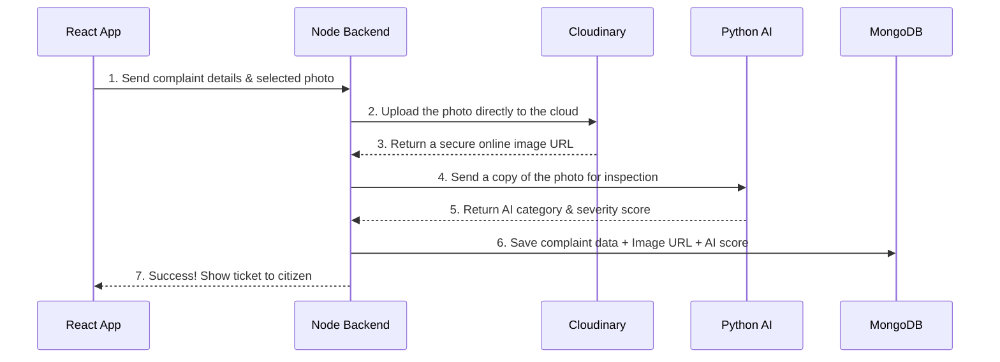

# Cloudinary Integration for Image Storage

This document outlines the recent changes made to switch the project from using the local filesystem (`server/uploads`) for image storage to utilizing **Cloudinary**.

## What Was Done

1. **Packages Installed**: We introduced two new npm packages in the backend server.
   * `cloudinary`: The main official SDK to communicate with Cloudinary's secure upload APIs.
   * `streamifier`: A utility to convert Node's native Buffer objects (held in memory by `multer`) into readable streams, which the Cloudinary API needs without forcing us to save the image to disk first.
2. **Environment Variables Configured**: Added Cloudinary API keys to our `server/.env` file (`CLOUDINARY_CLOUD_NAME`, `CLOUDINARY_API_KEY`, `CLOUDINARY_API_SECRET`).
3. **Database Types Adjusted**: Fixed a silent crash where MongoDB couldn't save `reportedBy` string identifiers (`admin-001`) by migrating the User Schema layout out of rigid `ObjectId` validation in favor of flexible strings.

## Files Impacted

### 1. Created `server/src/utils/cloudinary.js`
We created a dedicated utility module to initialize the Cloudinary instance and expose one primary asynchronous function: `uploadToCloudinary`.
* This module receives the image's binary `buffer` and pipes it over a stream securely to Cloudinary, specifying the `civiclens/tickets` folder to keep things organized.

### 2. Modified `server/src/controllers/ticketsController.js`
We ripped out all local file-system logic:
* Removed `fs/promises` imports.
* Deleted local file persistence helpers (`buildLocalPhotoFilename` & `persistUploadedPhotoLocally`).
* Modified the core logic of `postTicket()`: Instead of dropping the uploaded `multipart/form-data` payload into a local disk folder, it now directly funnels the memory buffer to our `uploadToCloudinary` utility and retrieves the live, production-ready image URL.

### 3. Modified `server/models/Ticket.js`
To ensure tickets successfully save alongside the active image upload, we amended line 59:
* Changed the schema type for `reportedBy` from `mongoose.Schema.Types.ObjectId` to `String`.

---

## Technical Flow Diagram

Here is a simplified step-by-step breakdown of how the photo upload works:

> **Note**: Your backend processes the image upload to Cloudinary and the AI analysis at the same time straight from its internal memory, making it lightning-fast and keeping your hard drive clear!
