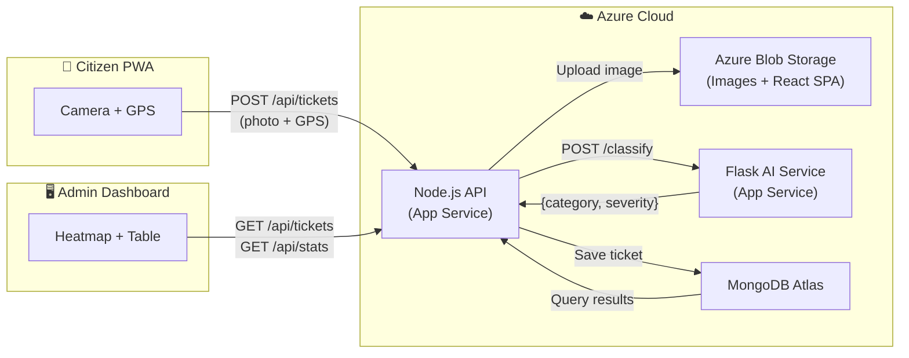

# HackOverflow — Execution Plan
## Crowdsourced Civic Issue Reporting & Resolution System (SIH25031)

> **Theme:** Urban to Global · **Duration:** 36 hours · **Team Size:** 3

---

## 1. The 36-Hour Timeline

> [!IMPORTANT]
> **Hard Feature Freeze:** Hour 28. After this point **NO** new features — only bug-fixing, polish, and deployment.

### Phase 1 — Scaffolding (Hours 0–6)

| Hour | Member 1 (Frontend) | Member 2 (Backend) | Member 3 (AI & Cloud) |
|------|---------------------|--------------------|-----------------------|
| 0–1 | `npx create-react-app` / Vite scaffold, TailwindCSS, folder structure, react-router setup | `npm init`, Express boilerplate, MongoDB Atlas cluster + connection, `.env` config | Create Flask project, virtual env, install `torch`/`ultralytics` or `tensorflow`, download pre-trained model weights |
| 1–3 | Build **CitizenReportPage** shell (photo upload + map pin UI stub), install Mapbox/Google Maps SDK | Define Mongoose schemas (`Ticket`), seed DB with 3–5 dummy tickets | Write `/classify` Flask endpoint, load model, test with a sample image, return `{category, confidence}` |
| 3–5 | Build **AdminDashboard** shell (table + map placeholder), toggle Citizen/Admin view button | Build `POST /api/tickets` and `GET /api/tickets` routes with dummy data | Containerise Flask app (Dockerfile), test locally with `curl` |
| 5–6 | Wire Mapbox/Google Maps to display dummy markers, style map container | Build `PATCH /api/tickets/:id` (status update), set up CORS, body-parser, multer | Create Azure Resource Group, provision Blob Storage container for images, test upload with Azure SDK |

> **Phase 1 Exit Criteria ✓** — Each member has a locally running service; all three can launch independently.

---

### Phase 2 — Core Grind (Hours 6–20)

| Hour | Member 1 (Frontend) | Member 2 (Backend) | Member 3 (AI & Cloud) |
|------|---------------------|--------------------|-----------------------|
| 6–10 | Complete **CitizenReportPage**: camera/file upload, GPS auto-detect via `navigator.geolocation`, description field, submit button | Integrate Azure Blob Storage upload in `POST /api/tickets` (receive image → upload to Blob → store URL), call Flask `/classify` from Node, store AI results in Ticket | Fine-tune classification labels (`pothole`, `garbage`, `broken_streetlight`, `waterlogging`, `other`), implement **severity scoring** logic (confidence × category weight), add `POST /health` endpoint |
| 10–14 | Build **AdminDashboard** — sortable/filterable ticket table (by status, severity, category), ticket detail modal with image + map | Build `GET /api/tickets?status=&category=&sort=severity` (query filtering & sorting), add aggregation endpoint `GET /api/stats` for dashboard counters | Provision **Azure App Service (Linux, B1)** for Node API, deploy & smoke-test. Provision second App Service for Flask API, deploy & smoke-test |
| 14–18 | Implement **heatmap layer** on admin map (cluster markers colored by severity), add real-time-style polling (`setInterval` / React Query refetch) | Connect all routes end-to-end with real AI responses, handle error cases (AI offline fallback: set category = "unclassified", severity = 5) | Enable **Azure CDN** on Blob Storage for image delivery, set up `$web` static website container for React build |
| 18–20 | Responsive styling pass — ensure citizen view is thumb-friendly on 375px viewport, admin view works on 1280px+ | Write light integration tests (Postman collection or `.http` file with 5 core requests), fix any schema validation issues | Deploy React production build to `$web` Blob container, configure CDN custom domain (if time permits) or use `*.azureedge.net` |

> **Phase 2 Exit Criteria ✓** — Full citizen report → AI classification → admin dashboard flow works end-to-end on deployed URLs.

---

### Phase 3 — Integration & Testing (Hours 20–28)

| Hour | Member 1 (Frontend) | Member 2 (Backend) | Member 3 (AI & Cloud) |
|------|---------------------|--------------------|-----------------------|
| 20–23 | Point all Axios calls to deployed Azure API URL (env variable), full end-to-end testing in production, fix CORS / URL issues | End-to-end debugging with real images, verify Blob URLs persist and are accessible, stress-test with 20+ tickets | Monitor Azure App Service logs, ensure Flask doesn't OOM on B1 tier — if model is too large, switch to MobileNetV2 (lighter) |
| 23–26 | Polish UI — loading spinners, success/error toasts, empty-state illustrations, smooth transitions | Add input validation middleware (Joi), ensure proper HTTP status codes (400, 404, 500), sanitize inputs | Set up environment variables in Azure portal for all services, verify all services auto-restart |
| 26–28 | **Feature Freeze (Hour 28)** — final responsive QA, screenshot every screen for the presentation | Final Postman collection export, verify all 5 API routes return correct responses | Final deployment verification: citizen URL → submit report → verify in admin dashboard → confirm image in CDN |

> **Phase 3 Exit Criteria ✓** — Bug-free production prototype accessible via a public URL.

---

### Phase 4 — Polish & Presentation (Hours 28–36)

| Hour | Member 1 (Frontend) | Member 2 (Backend) | Member 3 (AI & Cloud) |
|------|---------------------|--------------------|-----------------------|
| 28–30 | Design **presentation slides** — problem, solution, demo flow, architecture diagram, impact metrics | Write README.md — setup instructions, architecture overview, API docs | Create **architecture diagram** (draw.io / Excalidraw), record a 2-min demo video as backup |
| 30–33 | Rehearse demo script (citizen submits → admin sees prioritized issue), prepare for live demo edge cases | Seed DB with 10–15 realistic demo tickets (varied categories & severities) for impressive dashboard | Prepare fallback plan: if Azure goes down, have local `ngrok` tunnel ready |
| 33–36 | **Final rehearsal**, sync team on Q&A talking points (scalability, future auth, ML improvements) | Stand by for any last-minute API fixes | Stand by for any infra/deployment hotfixes |

---

## 2. Individual Task Checklists

### Member 1 — Frontend Lead

```
SCAFFOLDING (Hours 0–6)
[ ] Scaffold React app (Vite or CRA), install TailwindCSS, react-router-dom
[ ] Set up folder structure: /pages, /components, /services, /assets
[ ] Create CitizenReportPage shell with file upload input + map container
[ ] Create AdminDashboard shell with table placeholder + map container
[ ] Add Citizen/Admin toggle button (hardcoded, no auth)
[ ] Integrate Mapbox GL JS or Google Maps JS API, render map with dummy marker

CORE GRIND (Hours 6–20)
[ ] CitizenReportPage: camera capture/file picker, auto-fill GPS coords
[ ] CitizenReportPage: description textarea, submit button with loading state
[ ] Wire submit to POST /api/tickets via Axios, show success/error toast
[ ] AdminDashboard: ticket table with columns (ID, Category, Severity, Status, Date)
[ ] AdminDashboard: sort by severity (desc), filter by status & category
[ ] AdminDashboard: ticket detail modal (image preview, map pin, status dropdown)
[ ] AdminDashboard: heatmap layer on map (colored markers by severity)
[ ] AdminDashboard: auto-refresh every 15s via React Query / setInterval
[ ] Responsive pass: citizen view ≤ 480px, admin view ≥ 1280px

INTEGRATION (Hours 20–28)
[ ] Point API base URL to Azure-deployed backend via env variable
[ ] End-to-end test: submit photo → see classified ticket on admin dashboard
[ ] Add loading skeletons, empty states, error boundaries
[ ] Final mobile QA on real phone browser (Chrome DevTools ≠ real device)

POLISH (Hours 28–36)
[ ] Screenshot every screen for presentation
[ ] Build presentation slides (problem, solution, demo, architecture)
[ ] Rehearse live demo flow x3
```

---

### Member 2 — Backend Lead

```
SCAFFOLDING (Hours 0–6)
[ ] npm init, install express, mongoose, cors, dotenv, multer, axios
[ ] Connect to MongoDB Atlas, verify with a test document insert
[ ] Define Mongoose Ticket schema (see Section 3)
[ ] Seed DB with 3–5 dummy tickets
[ ] Create POST /api/tickets stub (accept multipart form data)
[ ] Create GET /api/tickets stub (return all tickets)
[ ] Create PATCH /api/tickets/:id stub (update status)

CORE GRIND (Hours 6–20)
[ ] POST /api/tickets: receive image via multer → upload to Azure Blob Storage → get URL
[ ] POST /api/tickets: forward image to Flask /classify → receive {category, severity}
[ ] POST /api/tickets: save complete ticket to MongoDB, return 201
[ ] GET /api/tickets: implement query params (?status, ?category, ?sort)
[ ] GET /api/stats: return aggregate counts {total, open, inProgress, resolved, bySeverity}
[ ] PATCH /api/tickets/:id: update status field, validate against enum
[ ] Add graceful fallback if Flask AI is unreachable (default category/severity)
[ ] Input validation with Joi (lat/lng ranges, allowed status values, required fields)

INTEGRATION (Hours 20–28)
[ ] End-to-end test with real images and production Flask URL
[ ] Verify CORS allows frontend origin, fix any header issues
[ ] Create Postman collection with all 5 routes and example payloads
[ ] Stress test: submit 20 tickets in 5 minutes, verify DB consistency

POLISH (Hours 28–36)
[ ] Seed 10–15 visually diverse demo tickets
[ ] Write README with API documentation
[ ] Stand by for hotfixes
```

---

### Member 3 — AI & Cloud Lead

```
SCAFFOLDING (Hours 0–6)
[ ] Create Flask app, virtual env, install dependencies (flask, torch/tensorflow, pillow)
[ ] Download pre-trained model (YOLOv8-cls or MobileNetV2)
[ ] Build POST /classify endpoint: accept image, run inference, return JSON
[ ] Test /classify with curl + sample pothole image
[ ] Write Dockerfile for Flask app
[ ] Create Azure Resource Group, Storage Account, Blob container "ticket-images"
[ ] Test Azure Blob upload using @azure/storage-blob SDK (share snippet with Member 2)

CORE GRIND (Hours 6–20)
[ ] Map model output labels → civic categories (pothole, garbage, broken_streetlight, waterlogging, other)
[ ] Implement severity scoring: severity = ceil(confidence * category_weight * 10)
    - category_weight: pothole=1.0, waterlogging=0.9, broken_streetlight=0.7, garbage=0.6, other=0.5
[ ] Add GET /health endpoint returning {"status": "ok", "model": "loaded"}
[ ] Provision Azure App Service #1 (Node.js, Linux B1) → deploy Member 2's API
[ ] Provision Azure App Service #2 (Python 3.10, Linux B1) → deploy Flask API
[ ] Smoke-test both deployed services via public URLs
[ ] Enable static website hosting on Blob Storage ($web container)
[ ] Build React frontend (npm run build) → upload dist/ to $web container
[ ] Optionally enable Azure CDN on static website endpoint

INTEGRATION (Hours 20–28)
[ ] Monitor App Service logs for OOM or cold-start issues
[ ] If model too heavy for B1 tier → swap to MobileNetV2 or resize input to 224x224
[ ] Set environment variables in Azure Portal (MONGO_URI, BLOB_CONNECTION_STRING, FLASK_URL)
[ ] Full pipeline test: public citizen URL → submit → AI classify → admin dashboard

POLISH (Hours 28–36)
[ ] Create architecture diagram (draw.io or Excalidraw)
[ ] Record 2-min backup demo video
[ ] Prepare local ngrok fallback if Azure has issues during demo
[ ] Stand by for infra hotfixes
```

---

## 3. MongoDB Schema — `Ticket` Collection

```javascript
// models/Ticket.js
const mongoose = require('mongoose');

const ticketSchema = new mongoose.Schema(
  {
    // --- Citizen Input ---
    description: {
      type: String,
      trim: true,
      maxlength: 500,
      default: '',
    },
    photoUrl: {
      type: String,
      required: [true, 'Photo URL is required'],
    },
    location: {
      type: {
        type: String,
        enum: ['Point'],
        default: 'Point',
      },
      coordinates: {
        type: [Number], // [longitude, latitude]
        required: [true, 'GPS coordinates are required'],
        validate: {
          validator: function (v) {
            return (
              v.length === 2 &&
              v[0] >= -180 && v[0] <= 180 &&  // longitude
              v[1] >= -90 && v[1] <= 90        // latitude
            );
          },
          message: 'Invalid coordinates. Must be [longitude, latitude].',
        },
      },
    },

    // --- AI-Generated Fields ---
    aiCategory: {
      type: String,
      enum: ['pothole', 'garbage', 'broken_streetlight', 'waterlogging', 'other', 'unclassified'],
      default: 'unclassified',
    },
    aiConfidence: {
      type: Number,
      min: 0,
      max: 1,
      default: 0,
    },
    severityScore: {
      type: Number,
      min: 1,
      max: 10,
      default: 5,
    },

    // --- Workflow ---
    status: {
      type: String,
      enum: ['open', 'in_progress', 'resolved'],
      default: 'open',
    },
  },
  {
    timestamps: true, // adds createdAt & updatedAt automatically
  }
);

// Geospatial index for map queries
ticketSchema.index({ location: '2dsphere' });

// Index for common dashboard queries
ticketSchema.index({ status: 1, severityScore: -1 });

module.exports = mongoose.model('Ticket', ticketSchema);
```

**Sample Document:**

```json
{
  "_id": "665f1a2b3c4d5e6f7a8b9c0d",
  "description": "Large pothole near Main St & 5th Ave intersection",
  "photoUrl": "https://yourstorageaccount.blob.core.windows.net/ticket-images/665f1a2b.jpg",
  "location": {
    "type": "Point",
    "coordinates": [85.3096, 23.3441]
  },
  "aiCategory": "pothole",
  "aiConfidence": 0.92,
  "severityScore": 10,
  "status": "open",
  "createdAt": "2026-03-11T12:00:00.000Z",
  "updatedAt": "2026-03-11T12:00:00.000Z"
}
```

---

## 4. API Contracts

### 4.1 Node.js / Express API (Port 3001)

---

#### `POST /api/tickets` — Submit a new civic issue report

**Content-Type:** `multipart/form-data`

| Field | Type | Required | Description |
|-------|------|----------|-------------|
| `photo` | File | ✅ | Image file (JPEG/PNG, max 5MB) |
| `description` | String | ❌ | Optional text description |
| `longitude` | Number | ✅ | GPS longitude (-180 to 180) |
| `latitude` | Number | ✅ | GPS latitude (-90 to 90) |

**Server Flow:**
1. Receive image via `multer`
2. Upload image to Azure Blob Storage → get `photoUrl`
3. Forward image to Flask `POST /classify` → get `{category, confidence, severity}`
4. Create Ticket document in MongoDB
5. Return created ticket

**Success Response — `201 Created`**

```json
{
  "success": true,
  "data": {
    "_id": "665f1a2b3c4d5e6f7a8b9c0d",
    "description": "Large pothole near Main St",
    "photoUrl": "https://storageaccount.blob.core.windows.net/ticket-images/665f1a2b.jpg",
    "location": {
      "type": "Point",
      "coordinates": [85.3096, 23.3441]
    },
    "aiCategory": "pothole",
    "aiConfidence": 0.92,
    "severityScore": 10,
    "status": "open",
    "createdAt": "2026-03-11T12:00:00.000Z",
    "updatedAt": "2026-03-11T12:00:00.000Z"
  }
}
```

**Error Response — `400 Bad Request`**

```json
{
  "success": false,
  "error": "Photo and GPS coordinates are required."
}
```

---

#### `GET /api/tickets` — List all tickets (with optional filters)

**Query Parameters:**

| Param | Type | Default | Description |
|-------|------|---------|-------------|
| `status` | String | — | Filter: `open`, `in_progress`, `resolved` |
| `category` | String | — | Filter: `pothole`, `garbage`, etc. |
| `sort` | String | `-severityScore` | Sort field, prefix `-` for descending |
| `page` | Number | `1` | Pagination page number |
| `limit` | Number | `50` | Results per page |

**Example:** `GET /api/tickets?status=open&sort=-severityScore&limit=20`

**Success Response — `200 OK`**

```json
{
  "success": true,
  "count": 2,
  "total": 45,
  "page": 1,
  "data": [
    {
      "_id": "665f1a2b3c4d5e6f7a8b9c0d",
      "description": "Large pothole near Main St",
      "photoUrl": "https://...",
      "location": { "type": "Point", "coordinates": [85.3096, 23.3441] },
      "aiCategory": "pothole",
      "aiConfidence": 0.92,
      "severityScore": 10,
      "status": "open",
      "createdAt": "2026-03-11T12:00:00.000Z"
    }
  ]
}
```

---

#### `GET /api/tickets/:id` — Get a single ticket

**Success Response — `200 OK`**

```json
{
  "success": true,
  "data": { /* full Ticket object */ }
}
```

**Error Response — `404 Not Found`**

```json
{
  "success": false,
  "error": "Ticket not found."
}
```

---

#### `PATCH /api/tickets/:id` — Update ticket status

**Content-Type:** `application/json`

**Request Body:**

```json
{
  "status": "in_progress"
}
```

**Success Response — `200 OK`**

```json
{
  "success": true,
  "data": {
    "_id": "665f1a2b3c4d5e6f7a8b9c0d",
    "status": "in_progress",
    "updatedAt": "2026-03-11T14:30:00.000Z"
  }
}
```

---

#### `GET /api/stats` — Dashboard aggregate statistics

**Success Response — `200 OK`**

```json
{
  "success": true,
  "data": {
    "total": 128,
    "byStatus": {
      "open": 74,
      "in_progress": 31,
      "resolved": 23
    },
    "byCategory": {
      "pothole": 42,
      "garbage": 35,
      "broken_streetlight": 22,
      "waterlogging": 18,
      "other": 11
    },
    "avgSeverity": 6.4
  }
}
```

---

### 4.2 Flask AI Microservice (Port 5000)

---

#### `POST /classify` — Classify a civic issue image

**Content-Type:** `multipart/form-data`

| Field | Type | Required | Description |
|-------|------|----------|-------------|
| `image` | File | ✅ | Image file (JPEG/PNG) |

**Success Response — `200 OK`**

```json
{
  "success": true,
  "category": "pothole",
  "confidence": 0.92,
  "severity": 10
}
```

> **Severity formula:** `severity = ceil(confidence × category_weight × 10)`
>
> | Category | Weight |
> |----------|--------|
> | pothole | 1.0 |
> | waterlogging | 0.9 |
> | broken_streetlight | 0.7 |
> | garbage | 0.6 |
> | other | 0.5 |

**Error Response — `500 Internal Server Error`**

```json
{
  "success": false,
  "error": "Classification failed.",
  "category": "unclassified",
  "confidence": 0.0,
  "severity": 5
}
```

---

#### `GET /health` — Health check

```json
{
  "status": "ok",
  "model": "YOLOv8-cls",
  "version": "1.0.0"
}
```

---

## 5. Azure Deployment Strategy — Member 3 Checklist

### Pre-requisites
```
[ ] Azure CLI installed and logged in (az login)
[ ] All environment variables documented in a shared .env.example file
```

### Step 1 — Create Resource Group (Once)
```bash
az group create --name rg-hackoverflow --location centralindia
```

### Step 2 — Azure Blob Storage (Images + React Static Site)
```bash
# Create storage account
az storage account create \
  --name hackoverflowstorage \
  --resource-group rg-hackoverflow \
  --location centralindia \
  --sku Standard_LRS

# Create container for ticket images (public read access)
az storage container create \
  --account-name hackoverflowstorage \
  --name ticket-images \
  --public-access blob

# Enable static website hosting for React SPA
az storage blob service-properties update \
  --account-name hackoverflowstorage \
  --static-website \
  --index-document index.html \
  --404-document index.html
```

### Step 3 — Deploy React Frontend
```bash
# From the React project root
npm run build

# Upload build output to $web container
az storage blob upload-batch \
  --account-name hackoverflowstorage \
  --source ./dist \
  --destination '$web' \
  --overwrite
```

> **Public URL:** `https://hackoverflowstorage.z29.web.core.windows.net`

### Step 4 — Deploy Node.js API to App Service
```bash
# Create App Service Plan
az appservice plan create \
  --name asp-hackoverflow \
  --resource-group rg-hackoverflow \
  --sku B1 \
  --is-linux

# Create Node.js Web App
az webapp create \
  --name hackoverflow-api \
  --resource-group rg-hackoverflow \
  --plan asp-hackoverflow \
  --runtime "NODE:18-lts"

# Set environment variables
az webapp config appsettings set \
  --name hackoverflow-api \
  --resource-group rg-hackoverflow \
  --settings \
    MONGO_URI="mongodb+srv://..." \
    AZURE_STORAGE_CONNECTION_STRING="..." \
    FLASK_API_URL="https://hackoverflow-ai.azurewebsites.net" \
    PORT=3001

# Deploy via ZIP deploy (from backend project root)
zip -r api.zip . -x "node_modules/*"
az webapp deploy \
  --name hackoverflow-api \
  --resource-group rg-hackoverflow \
  --src-path api.zip \
  --type zip
```

### Step 5 — Deploy Flask AI Service to App Service
```bash
# Create Python Web App (same App Service Plan)
az webapp create \
  --name hackoverflow-ai \
  --resource-group rg-hackoverflow \
  --plan asp-hackoverflow \
  --runtime "PYTHON:3.10"

# Set startup command
az webapp config set \
  --name hackoverflow-ai \
  --resource-group rg-hackoverflow \
  --startup-file "gunicorn --bind=0.0.0.0:8000 --timeout 120 app:app"

# Deploy via ZIP (from Flask project root)
zip -r ai.zip . -x "__pycache__/*" ".venv/*"
az webapp deploy \
  --name hackoverflow-ai \
  --resource-group rg-hackoverflow \
  --src-path ai.zip \
  --type zip
```

### Step 6 — Verification Checklist
```
[ ] curl https://hackoverflow-ai.azurewebsites.net/health → {"status": "ok"}
[ ] curl https://hackoverflow-api.azurewebsites.net/api/tickets → 200 OK
[ ] Open https://hackoverflowstorage.z29.web.core.windows.net → React app loads
[ ] Submit a test report from citizen UI → verify it appears on admin dashboard
[ ] Verify uploaded image is accessible via Blob CDN URL
```

### Fallback Plan
```
[ ] If Azure is slow/down during demo → run all services locally on laptop
[ ] Use ngrok to expose local ports: ngrok http 3001
[ ] Update React env var to point to ngrok URL
[ ] Keep this ready as a warm standby from Hour 30 onward
```

---

## 6. Architecture Reference



---

## 7. Key Constraints & Decisions

| Decision | Rationale |
|----------|-----------|
| **No authentication** | Saves ~4 hours. Use a simple toggle button for Citizen/Admin view. |
| **No WebSockets** | Polling every 15 seconds is sufficient for demo. Saves complexity. |
| **MobileNetV2 as fallback model** | If YOLOv8 is too heavy for Azure B1 tier, MobileNetV2 runs under 200MB RAM. |
| **GeoJSON Point format** | MongoDB's native `2dsphere` index enables efficient geo-queries for the heatmap. |
| **Severity = confidence × weight × 10** | Simple, explainable formula. Easy to demonstrate and defend to judges. |
| **Feature freeze at Hour 28** | 8 full hours for polish, testing, and presentation prep. Non-negotiable. |

---

> [!TIP]
> **Winning Tip:** Judges care about **story** as much as code. Spend Hours 28–36 crafting a narrative: *"A citizen snaps a photo → AI instantly categorizes it → the city sees a real-time heatmap of hazards → resources are dispatched to the highest-severity issues first."* Practice the live demo until it's effortless.
